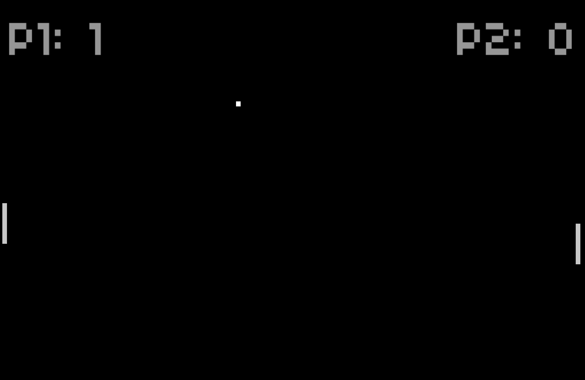
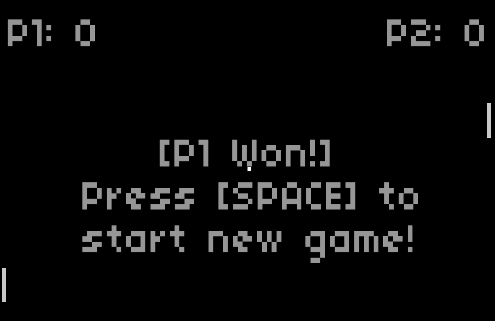

# sfml-pong
Simple 2-player pong game written with SFML and C++.
First to 3 points wins.

## Controls
* W: move left paddle up.
* S: move left paddle down.
* I: move right paddle up.
* K: move right paddle down.
* Space: pause game.

